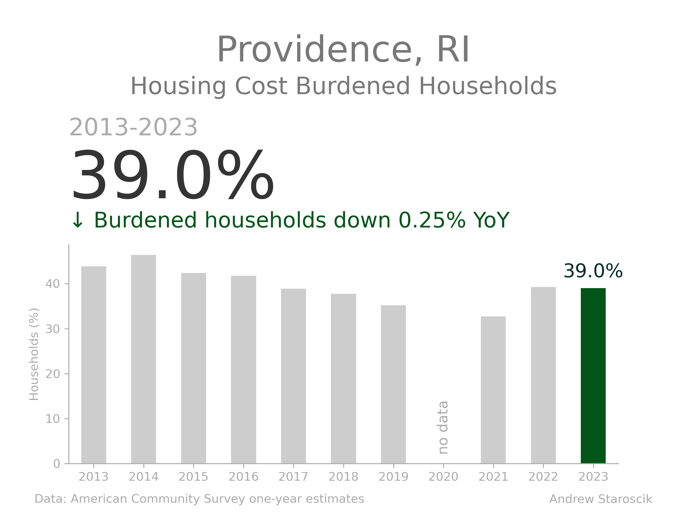

# Housing Cost Burden by ACS Place as a KPI Card

This is a demonstration of the ability to use ACS data to generate location specific summary stats using Python and using it to make KPI-like cards for social determinants of health data. 

It will work for any municipality in the places dataset which is all U.S. cities and towns with populations greater than 65,000. 

Read more on [LinkedIn](https://www.linkedin.com/posts/andrew-staroscik-a2853a7_python-datavisualization-activity-7272262717380431873-Hrf3)

### Finding the state and municipality data

This code will pull the the data from ACS for a chosen year for any of the municipalities that are in the places dataset using the fips numbers for the state and the municipality. 

This url [https://api.census.gov/data/2019/acs/acs1?get=NAME&for=place:*&in=state:*](https://api.census.gov/data/2019/acs/acs1?get=NAME&for=place:*&in=state:*) gives an unsorted list of all of the municipalities in the places database for 2019. 

Data for any other year can be found by changing the year. 

To look at any given state, replace the * in "state:*" with the two digit code for each state. 

For example this url: [https://api.census.gov/data/2022/acs/acs1?get=NAME&for=place:*&in=state:08](https://api.census.gov/data/2022/acs/acs1?get=NAME&for=place:*&in=state:08) will give the cities and towns in Colorado that are in the 1-year places dataset for 2022. 

The number for each state can be pulled from this url: [https://api.census.gov/data/2019/acs/acs1?get=NAME&for=state:*](https://api.census.gov/data/2019/acs/acs1?get=NAME&for=state:*)

